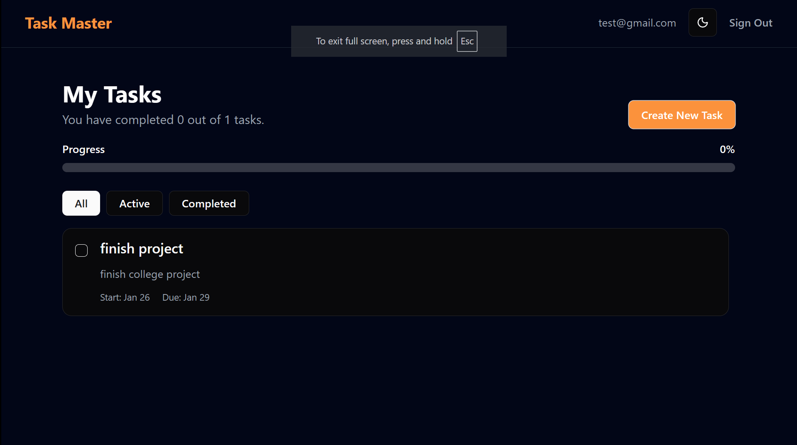

📝 ProTask - Modern Task Management Dashboard
A robust, full-stack task management application built to demonstrate advanced React patterns, secure authentication, and real-time database interactions. This project goes beyond a simple "To-Do List" by implementing professional-grade features like optimistic UI updates, protected routing, and a responsive dashboard layout.

🚀 Key Features
🔐 Security & Architecture
Supabase Authentication: Secure user login and signup flows managed via Supabase Auth.

Protected Routes: Implemented a custom ProtectedRoute wrapper to prevent unauthorized access to the dashboard.

Row Level Security (RLS): Database policies ensure users can only view and edit their own tasks.

⚡ Advanced functionality
Full CRUD Operations: Create, Read, Update, and Delete tasks with a seamless UI.

Optimistic Updates: The UI updates instantly when deleting or modifying tasks, providing a snappy user experience before the database confirms the change.

Undo Capability: "deleted" tasks can be restored within seconds via an interactive Toast notification.

Smart Filtering: Client-side filtering to instantly toggle between "All," "Active," and "Completed" tasks without re-fetching.

🎨 UI/UX Design
Professional Dashboard Layout: Features a fixed sidebar/header with an independent scrollable task area (using Tailwind CSS flex-col and overflow-hidden patterns).

Dark Mode Support: Fully integrated dark/light theme toggle.

Modern Components: Built with Shadcn/UI and Tailwind CSS for a polished, accessible, and responsive interface.

Interactive Feedback: Replaced standard browser alerts with non-blocking Toasts for success and error messages.

🛠️ Tech Stack
Frontend: React (Vite), React Router v6

Styling: Tailwind CSS, Shadcn/UI, Lucide Icons

Backend & Database: Supabase (PostgreSQL)

State Management: React Hooks (useState, useEffect, useContext)

Date Handling: date-fns

📸 Snapshots
Task Management: Efficiently manage tasks with a clean card-based layout.

Edit Modal: Updates are handled via a pre-filled dialog modal to keep the UI clean.

🚦 How to Run Locally
Clone the repository

Bash
git clone https://github.com/yourusername/task-manager.git
Install dependencies

Bash
npm install
Set up Environment Variables Create a .env file and add your Supabase credentials:

Code snippet
VITE_SUPABASE_URL=your_supabase_url
VITE_SUPABASE_ANON_KEY=your_supabase_key
Run the App

Bash
npm run dev